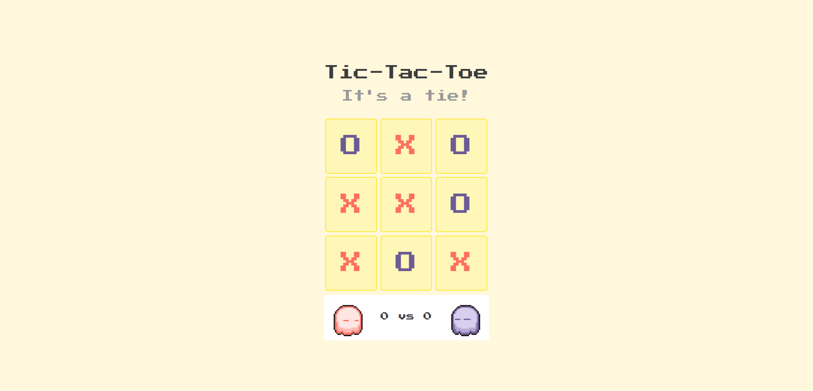
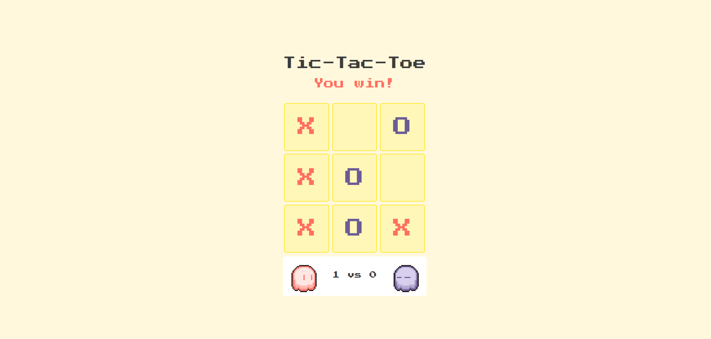

# 🎮 Pixelated Tic-Tac-Toe
---

## ✨ Features

- 🟧 Pixelated animated **X** and **O**
- 🤖 Play against the computer
- 📱 Fully **mobile responsive**
- 🎨 Custom color themes:
  - Player: `#FF6F61`
  - Computer: `#6B5B95`
- 💡 Turn indicator with color-coded messages
- 🖱️ Custom cursor
- 🔁 Replay/reset functionality (optional)

---

## 📁 File Structure

```

├── index.html
├── style.css
├── script.js
├── assets/
│   └── cursor.png
│   └── defaultCursor.png
│   └── player1default.png
│   └── player1win.png
│   └── player2default.png
│   └── player2win.png
```
---

## 🛠 How to Run

1. Clone or download the repository.
2. Open `index.html` in a browser.
3. Click on the tiles to place your X or O.

---

## 📷 Screenshots





---

## 🚀 Future Scope

- Smarter AI (minimax or heuristic-based)
- Winning line animation
- Sound effects and background music
- **Play with a friend via shareable online link**
- **Chrome extension version**
- Game history

---

## 🧠 Built With

- HTML5, CSS3, JavaScript
- Passion for pixel-art aesthetics
- Clean and scalable architecture

---

## 📄 License

MIT License — feel free to use and modify.

---
```

